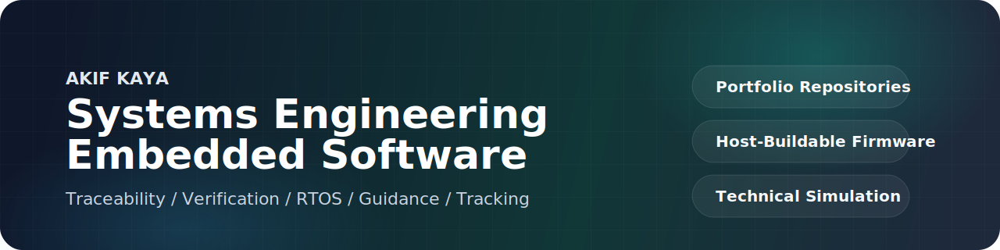

<h1 align="center">Akif Kaya</h1>

<strong>Systems Engineering • Embedded Software • Defense-Style Simulation</strong>

  

  Building portfolio-grade repositories around traceability, verification readiness,
  firmware architecture, RTOS behavior, guidance laws, tracking, and RF analysis.

  
  
  
  

  

<table>
  <tr>
    <td width="50%">
      
    </td>
    <td width="50%">
      
    </td>
  </tr>
</table>

  

## Profile Focus

| Track | What I build |
| --- | --- |
| Systems Engineering | Requirements, traceability, interface control, risk linkage, verification readiness |
| Embedded Systems | Host-buildable firmware projects in C with BMS, OTA bootloader, CAN, diagnostics, control logic |
| Technical Simulation | RTOS behavior, guidance laws, target tracking, RF link analysis, network degradation studies |

## Languages In This Codebase

  
  
  
  
  
  
  

## Featured Repositories

| Repository | Area | Why it matters |
| --- | --- | --- |
| [systems-engineering-traceability-lab](https://github.com/akifitu/systems-engineering-traceability-lab) | Systems Engineering | End-to-end traceability, interface checks, risk linkage, and audit-ready outputs |
| [verification-readiness-dashboard](https://github.com/akifitu/verification-readiness-dashboard) | Verification | Static dashboard for requirement closure, evidence state, and blocked work |
| [embedded-systems-collection](https://github.com/akifitu/embedded-systems-collection) | Embedded | Host-buildable C portfolio with BMS, OTA bootloader, CAN, diagnostics, and control logic |
| [embedded-rtos-sim](https://github.com/akifitu/embedded-rtos-sim) | Real-Time Systems | Preemptive scheduler, semaphores, queues, and defense-style task scenarios |
| [guidance-algorithm](https://github.com/akifitu/guidance-algorithm) | Guidance | Pure Pursuit, PN, APN, and CLOS missile guidance simulation |
| [target-tracking-system](https://github.com/akifitu/target-tracking-system) | Tracking | Multi-target tracking with Kalman filters, gating, and Hungarian association |

## Repository Map

<strong>Systems Engineering and MBSE</strong>

- [systems-engineering-traceability-lab](https://github.com/akifitu/systems-engineering-traceability-lab)
- [verification-readiness-dashboard](https://github.com/akifitu/verification-readiness-dashboard)
- [autonomous-campus-shuttle-requirements-lab](https://github.com/akifitu/autonomous-campus-shuttle-requirements-lab)
- [requirements-to-verification-lab](https://github.com/akifitu/requirements-to-verification-lab)
- [hbt-system-architecture-mbse](https://github.com/akifitu/hbt-system-architecture-mbse)
- [tactical-comms-system-engineering-demo](https://github.com/akifitu/tactical-comms-system-engineering-demo)
- [degraded-network-test-harness](https://github.com/akifitu/degraded-network-test-harness)

<strong>Embedded and Real-Time Systems</strong>

- [embedded-systems-collection](https://github.com/akifitu/embedded-systems-collection)
- [embedded-rtos-sim](https://github.com/akifitu/embedded-rtos-sim)

<strong>Tracking, Guidance, and RF Simulation</strong>

- [guidance-algorithm](https://github.com/akifitu/guidance-algorithm)
- [target-tracking-system](https://github.com/akifitu/target-tracking-system)
- [radar-kalman-tracker](https://github.com/akifitu/radar-kalman-tracker)
- [comm-link-budget](https://github.com/akifitu/comm-link-budget)

<strong>Product and Tooling Experiments</strong>

- [netsentinel](https://github.com/akifitu/netsentinel)
- [syswatch](https://github.com/akifitu/syswatch)
- [ai-news-summarizer](https://github.com/akifitu/ai-news-summarizer)
- [raycast-note-extension](https://github.com/akifitu/raycast-note-extension)
- [basic-weekly-planner](https://github.com/akifitu/basic-weekly-planner)

## Repository Standard

1. Clear one-line value proposition
2. Repository or system map that explains structure quickly
3. Reproducible quick start with observable output
4. Tests and CI so the repo reads like engineering work
5. Short design notes that explain portfolio relevance

Reusable template: [REPOSITORY_TEMPLATE.md](./REPOSITORY_TEMPLATE.md)

## Notes

- Most defense-oriented scenarios here are fictional portfolio exercises used to demonstrate engineering workflow and technical reasoning.
- New repositories are being standardized around the same structure and writing style for a cleaner profile experience.
